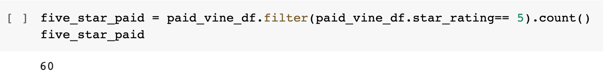

# Amazon_Vine_Analysis
Using PySpark to analyze the vine reviews 

## Overview 
This project aims to analyze the Amazon Reviews form of Vine to understand if there is any bias. 
To proceed with the project, we used Pyspark to Perform ETL on Amazon Wireless Product Reviews 
to extract the review data.

## Resources
- Data: https://s3.amazonaws.com/amazon-reviews-pds/tsv/index.txt
- Source: PySpark, Google Colab, ETL, SQL.

## Results 
- How many Vine reviews and non-Vine reviews were there?

.

- How many Vine reviews were 5 stars? How many non-Vine reviews were 5 stars?

.

- What percentage of Vine reviews were 5 stars? What percentage of non-Vine reviews were 5 stars?

.

## Summary 
